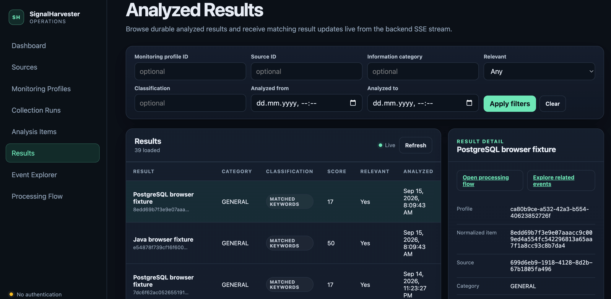

# SignalHarvester Web

Web frontend for SignalHarvester. The current application is an administrative, operational, and diagnostic UI over backend REST and SSE contracts.

The application intentionally starts without authentication and is intended for local or otherwise trusted environments only. It uses the backend REST/OpenAPI contract and does not access Kafka or PostgreSQL directly.

## Interface



The web UI provides one place to configure sources and monitoring profiles, start and inspect collection runs, review analyzed results, and investigate pipeline behavior. The Results screen shown above combines filtering, live SSE updates, result details, and direct navigation to related processing flows and technical events.

## Start here

| Goal | Read |
|---|---|
| Repository development rules | [`AGENTS.md`](AGENTS.md) |
| Frontend product target and active work | [`docs/specs/README.md`](docs/specs/README.md) |
| Stable frontend architecture | [`docs/ARCHITECTURE.md`](docs/ARCHITECTURE.md) |
| Current implemented behavior | [`docs/IMPLEMENTATION.md`](docs/IMPLEMENTATION.md) |
| Current UI workflows | [`docs/USAGE.md`](docs/USAGE.md) |
| Frontend roadmap | [`docs/ROADMAP.md`](docs/ROADMAP.md) |

## Current screens

- Dashboard — quick counts and recent collection status.
- Sources — create, edit, enable/disable, delete, and diagnostically test configured sources.
- Monitoring Profiles — configure category, interval, source membership, criteria, and scheduled enabled state.
- Collection Runs — start a persisted monitoring profile manually and inspect durable run/source outcomes.
- Analysis Items — inspect persisted normalized/deduplication state with profile/source filters.
- Results — browse analyzed result projections, receive matching live SSE updates, and inspect content, attributes, and provenance.
- Event Explorer — inspect bounded technical event history and follow live observed pipeline events.
- Processing Flow — visualize backend-reconstructed run/item stages, evidence, durations, and diagnostic metadata.

## Technology

- React + TypeScript
- Vite
- TanStack Query
- React Router
- OpenAPI-derived TypeScript types
- Playwright browser verification

## Requirements

- Node.js 22+
- npm 10+
- SignalHarvester backend running locally, normally on `http://localhost:8080`

## Run locally

```bash
npm install
npm run api:generate
npm run typecheck
npm test
npm run dev
```

Open `http://localhost:5173`.

The Vite development server proxies `/api` to `http://localhost:8080`, so backend CORS changes are not required for the normal local workflow.

Override the development backend when needed:

```bash
VITE_DEV_PROXY_TARGET=http://localhost:8081 npm run dev
```

For a separately hosted frontend build, set `VITE_API_BASE_URL` to the backend origin before building. If frontend and backend use different origins, the backend must explicitly allow that origin.

## Browser verification

Install the Playwright Chromium browser once after installing npm dependencies:

```bash
npm run e2e:install
```

Run deterministic browser tests with controlled REST responses:

```bash
npm run e2e
```

These tests start their own Vite server. They do not require the SignalHarvester backend, PostgreSQL, Kafka/Redpanda, or public internet sources. The deterministic suite includes a small reviewed visual-regression baseline for the populated Results/detail workspace. Failed tests retain Playwright traces, screenshots, and visual diffs under ignored `test-results/` directories.

Run only the reviewed visual comparison when investigating or reviewing that baseline:

```bash
npm run e2e:visual
```

When an intentional UI change requires updating a reviewed golden image, run:

```bash
npm run e2e:visual:update
```

Inspect the changed PNG, run `npm run e2e:visual`, and then run the normal repository gate before committing it. Routine verification never updates visual baselines automatically.

Run the opt-in live browser workflow against a separately running backend:

```bash
SIGNALHARVESTER_BACKEND_URL=http://127.0.0.1:8080 npm run e2e:live
```

The live test starts a temporary two-entry RSS server, creates and diagnostically tests a temporary RSS source, and creates a temporary monitoring profile through the UI. It establishes filtered Results SSE before the first manual run and requires both fixture Results to arrive without `Refresh`, keeps the bounded Analysis inspection check, then establishes Event Explorer SSE before a second run and requires a newly correlated observed event to arrive without `Refresh`. Finally it follows a real Analysis event into the backend-reconstructed item and full-run Processing Flow views, then deletes the profile before removing the source. The default fixture address assumes the backend runs on the same host. If a containerized backend can reach the host through another hostname, advertise it with `SIGNALHARVESTER_LIVE_FIXTURE_HOST`, for example `host.docker.internal`.

A complete routine frontend verification is:

```bash
./run_checks.sh
```

The script regenerates OpenAPI types, typechecks application and browser-test code, runs Vitest, runs the deterministic Playwright suite, builds the production frontend, verifies that primary screens remain route-level dynamic build entries, and prints the production JS/CSS raw and gzip asset baseline. `npm run e2e:live` remains separate because it requires a real backend and its infrastructure.

Inspect the production route-chunk structure and asset baseline after a build with:

```bash
npm run build
npm run build:assets
```

The asset report is informational for now. A numeric size budget should be added only after the measured baseline and acceptable growth policy are reviewed.

## OpenAPI workflow

The backend contract snapshot used by this repository is:

```text
openapi/signalharvester-v1.yaml
```

After copying in a newer backend OpenAPI file, regenerate types:

```bash
npm run api:generate
npm run typecheck
```

`src/api/generated.ts` is generated contract output. Application code should depend on the exported OpenAPI schema types rather than duplicating REST DTOs.

## Authentication status

There is deliberately no login, session, token, or role model in this first version. Keep the admin UI and backend on a trusted local/private environment until authentication and authorization are implemented.

## Documentation model

Current-state documentation and active specifications have different roles. `docs/ARCHITECTURE.md`, `docs/IMPLEMENTATION.md`, and `docs/USAGE.md` describe accepted current behavior. `docs/specs/active/` defines intended frontend changes and acceptance targets.

The backend repository remains authoritative for REST/OpenAPI and future SSE contracts. This repository owns browser behavior and frontend implementation details.
