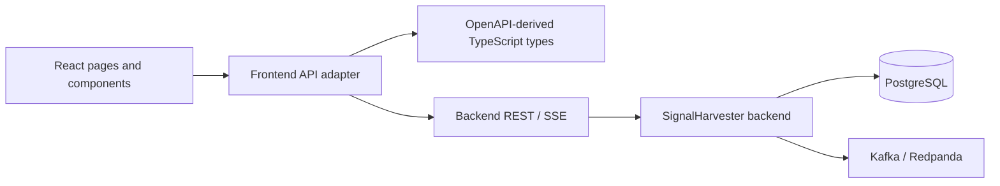

# SignalHarvester Web architecture

## Purpose

This document owns stable accepted frontend architecture. Active specifications describe intended or verification-pending changes and may contain more detail while work is in progress.

Stable frontend capability names are owned by [`FEATURES.md`](FEATURES.md).

## Core architectural decision

SignalHarvester Web is a separate React application and repository. It consumes explicit backend application contracts and does not share backend source code, persistence models, Kafka clients, or generated Java types.

The browser boundary is intentionally narrow:

- request/response APIs use REST/JSON;
- REST request and response shapes come from the checked-in backend OpenAPI snapshot;
- live browser updates use backend SSE/JSON;
- the browser never connects directly to PostgreSQL or Kafka.

The application is currently administrative and operational, but it is also the foundation for broader product-facing UI. Do not create a second frontend application merely to separate current admin screens from future viewer-oriented screens.

Primary features: `WEB.APP_SHELL`, `WEB.CONTRACT_INTEGRATION`, `WEB.SERVER_STATE`.

## Dependency direction



Frontend code may depend on public backend application contracts. It must not depend on backend implementation packages, database tables, or Kafka topics as browser transports.

## Repository structure

```text
signalharvester-web/
├── docs/                       # Current-state docs, feature vocabulary, specs
├── openapi/                    # Checked-in backend OpenAPI snapshot
├── src/
│   ├── api/                    # HTTP/SSE boundary and OpenAPI-derived types
│   ├── components/             # Shared presentation components
│   ├── features/               # Screen-oriented feature code
│   ├── lib/                    # Small deterministic helpers
│   ├── styles/                 # Application CSS
│   ├── App.tsx                 # Route composition
│   └── main.tsx                # React/query/router composition root
├── tests/e2e/                  # Deterministic and opt-in live Playwright tests
├── playwright.config.ts        # Backend-independent browser suite
├── playwright.live.config.ts   # Real-backend browser suite
├── run_checks.sh               # Canonical routine verification
├── package.json
└── vite.config.ts
```

Feature folders own screen-specific presentation and interaction logic. Introduce shared abstractions only when they remove real duplication without hiding API behavior.

## Application composition and routing

`src/main.tsx` owns browser composition:

- React root creation;
- `QueryClientProvider`;
- `AuthSessionProvider`;
- `BrowserRouter`;
- application-wide CSS.

`src/App.tsx` owns the route table. `/login` is the eager authentication entry point; protected routes are composed behind authentication and role presentation guards. `AppShell` owns authenticated navigation, identity display, logout, and common layout.

Primary routes are lazy-loaded:

- `/` — Dashboard;
- `/sources` — source configuration and Source Test;
- `/profiles` — Monitoring Profile configuration;
- `/runs` — profile-driven Collection Runs;
- `/analysis` — normalized/deduplication inspection;
- `/results` — role-specific analyzed Results browsing, detail, and live updates;
- `/events` — bounded technical event history/live updates;
- `/flows` — backend-reconstructed run/item processing graphs;
- `/users` — ADMIN identity administration.

The shell remains mounted while a route module loads. A `Suspense` state exposes accessible loading feedback, and a route-resetting error boundary contains route import/render failures inside the main content region.

Future screens should extend this routing model. Preserve route-level splitting for primary screens unless measured delivery behavior justifies eager loading.

Primary features: `WEB.APP_SHELL`, `WEB.AUTH_SESSION`, `WEB.AUTHORIZATION_UX`, `WEB.ROUTE_DELIVERY`, `WEB.ASYNC_FEEDBACK`.

## Backend contract ownership

The backend OpenAPI document is the source of truth for REST wire shapes. This repository keeps the consumed snapshot at:

```text
openapi/signalharvester-v1.yaml
```

`openapi-typescript` generates `src/api/generated.ts`. Application-facing aliases live in `src/api/types.ts`.

The contract flow is:

```text
backend OpenAPI
    -> checked-in frontend snapshot
    -> openapi-typescript
    -> generated TypeScript schema types
    -> API adapter and feature code
```

Do not manually duplicate backend DTOs or hand-edit generated types after normal generation is available.

`src/api/client.ts` is the current transport boundary. It owns API base URL handling, REST path/query construction, credentialed fetch, double-submit CSRF forwarding for unsafe requests, JSON/text response handling, common HTTP error conversion, and protected-request `401` notification. Feature components use this adapter through TanStack Query instead of issuing independent ad-hoc requests. JavaScript never reads or decodes the HttpOnly authentication JWT.

The adapter should remain small while that keeps behavior explicit. Introduce a larger generated client or another HTTP library only when the existing boundary becomes materially difficult to maintain.

Primary feature: `WEB.CONTRACT_INTEGRATION`.

## Server and local state

TanStack Query owns remote/server state such as the current authenticated principal, Sources, Monitoring Profiles, Collection Runs, Analysis inspection records, Results, observed events, and Processing Flows. The principal is re-read from `/api/v1/auth/me` after login rather than inferred from credentials or JWT contents.

Local React state owns transient browser concerns such as:

- form input before submission;
- selected rows/details;
- unapplied filters;
- local panel visibility;
- focus/interaction state.

Do not copy backend state into a second global client store without a concrete requirement.

The shared Query Client currently uses a short stale period, one retry, and no automatic refetch on window focus. Durable REST state is supplemented by SSE where the backend publishes live contracts.

Primary feature: `WEB.SERVER_STATE`.

## Async and error behavior

Data-driven screens explicitly distinguish applicable states:

- loading;
- request failure;
- successful empty result;
- successful populated result.

Mutations and live connections expose enough feedback to distinguish success, failure, and reconnecting/stale states where freshness is affected.

HTTP failures should preserve useful backend error text when available. Browser-side validation may improve immediate feedback, but backend validation remains authoritative.

Primary feature: `WEB.ASYNC_FEEDBACK`.

## Live Results and Event Observation

The browser uses REST for durable snapshots and backend SSE for live Results and technical Event Observation.

Native `EventSource` is created with `withCredentials: true` and owns reconnect and `Last-Event-ID` behavior. Authentication is never placed in SSE URLs. For race-free bootstrap, the frontend waits for SSE `ready`, then loads the REST snapshot while buffering subsequent live messages, and finally merges both into the TanStack Query cache.

Live delivery supplements durable reads. It does not replace backend persistence or turn the browser into an event-store client.

Primary features: `WEB.RESULTS_LIVE`, `WEB.EVENT_EXPLORER`, `WEB.SERVER_STATE`.

## Processing Flow projection

Processing Flow is a read-only presentation of the backend `ProcessingFlow` reconstruction contract.

The browser may order returned nodes for presentation, but it must not:

- infer missing stages;
- synthesize evidence;
- join raw Event Explorer rows into an independent processing graph.

The visualization preserves backend evidence classes, state, and limitations. A horizontal lane per `branchId` keeps repeated logical items from different runs separate. Deep links between Runs, Results, Events, and Flow carry public run/item/event identifiers only.

The current graph is an ordered processing path, so semantic controls and CSS layout are preferred over a general graph framework.

Primary feature: `WEB.PROCESSING_FLOW`.

## Presentation and responsive behavior

The UI uses React components and repository-owned CSS without a third-party component framework.

Accessibility behavior should remain explicit through semantic landmarks, native controls, accessible names, status/alert roles, and normal keyboard focus behavior.

Large bounded backend responses remain backend-owned. The browser may use local table/list/graph scrolling and wrapping, but must not invent pagination, truncation, or ordering semantics that the backend contract does not publish.

A component library should be added only when repeated interaction/accessibility patterns justify the dependency and migration cost.

Primary features: `WEB.ACCESSIBILITY`, `WEB.RESPONSIVE_LAYOUT`.

## Security boundary

Backend security is the enforcement boundary. Frontend role checks control navigation and presentation only; they must not replace backend authorization or infer role hierarchy. In particular, `ADMIN` does not imply `VIEWER`.

The implemented security foundation uses the backend-published browser contract:

- anonymous login through `POST /api/v1/auth/login`;
- current-principal bootstrap through `GET /api/v1/auth/me`;
- HttpOnly authentication cookie transport through `credentials: 'include'`;
- readable signed `XSRF-TOKEN` copied exactly into `X-CSRF-TOKEN` for unsafe requests other than login;
- native SSE opened with credentials and without tokens in URLs;
- logout through the same credentialed/CSRF-protected transport;
- protected-request `401` invalidates the frontend principal and non-auth application cache;
- `403` preserves the authenticated principal and remains an authorization error.

`AuthSessionProvider` owns principal bootstrap/lifecycle. Login passwords remain local form state and are not stored in TanStack Query, Web Storage, URLs, or logs.

Role-aware presentation exposes administrative/diagnostic screens to explicit `ADMIN`. The operational Results screen is mounted only for principals that have both `ADMIN` and `VIEWER`; a `VIEWER`-only principal receives a consumer-oriented Result feed that reuses the same backend Results REST/SSE boundary without rendering operational diagnostic metadata. `USER`-only and `BOT`-only principals receive no invented browser capability.

ADMIN identity management uses the same credentialed/CSRF-protected transport and remains presentation over backend-owned identity invariants. Viewer Results remains a presentation boundary rather than a new backend authorization or data contract. Cross-origin production hosting still depends on an explicitly compatible backend CORS and cookie policy.

Features: `WEB.AUTH_SESSION`, `WEB.AUTHORIZATION_UX`, `WEB.IDENTITY_ADMIN`, `WEB.VIEWER_RESULTS`.

## Testing architecture

Verification is split by ownership and dependency cost.

Vitest owns small deterministic TypeScript logic. Playwright owns browser behavior under `tests/e2e/**`.

The browser verification layers are:

1. `npm run e2e` — deterministic backend-independent navigation, rendering, forms, request construction, filters, detail loading, SSE browser behavior, accessibility, responsive edge cases, route loading/failure, and representative async states;
2. `npm run e2e:visual` — focused non-updating comparison against the reviewed Results/detail golden;
3. `npm run e2e:live` — bounded opt-in acceptance against a separately running security-enabled backend and deterministic local RSS fixture, after browser login with an explicit `ADMIN` + `VIEWER` test identity.

The live suite verifies browser-visible REST/SSE and processing-flow behavior. It does not verify Kafka offsets, database rows, transactions, deduplication semantics, or backend analysis rules.

`./run_checks.sh` is the canonical routine repository gate and includes deterministic browser verification. Live-backend E2E remains separate because this repository does not own backend process/infrastructure lifecycle.

Primary features: `WEB.BROWSER_VERIFICATION`, `WEB.VISUAL_REGRESSION`, `WEB.LIVE_BACKEND_ACCEPTANCE`.

## Delivery model

Development uses Vite and normally proxies `/api` to a local backend.

Production-style builds are static frontend assets configured with a backend origin through `VITE_API_BASE_URL` at build time. Vite emits a production manifest. Repository verification checks that primary screen modules remain dynamic entries and reports generated JavaScript/CSS raw and gzip sizes.

The asset report is informational until a reviewed baseline and acceptable growth policy justify numeric budgets.

Backend and frontend remain independently buildable deliverables joined through explicit REST/SSE contracts rather than source-level coupling.

Primary features: `WEB.ROUTE_DELIVERY`, `WEB.CONTRACT_INTEGRATION`.
