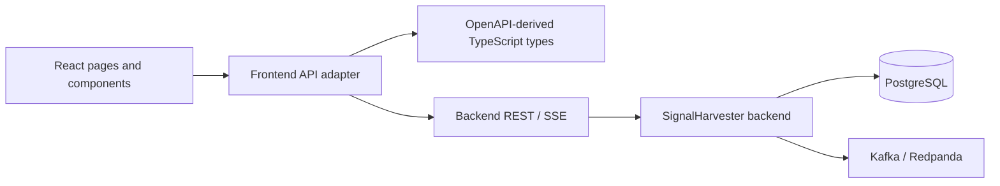

# SignalHarvester Web architecture

## Purpose

This document owns stable accepted frontend architecture. Active specifications describe intended changes and may contain more detail while work is in progress.

## Core architectural decisions

SignalHarvester Web is a separate React application and repository. It consumes explicit backend application contracts and does not share backend source code, persistence models, or Kafka clients.

The browser boundary is intentionally narrow:

- request/response application APIs use REST/JSON;
- REST request and response shapes come from the checked-in backend OpenAPI contract;
- live browser updates use backend SSE/JSON;
- the browser never connects directly to PostgreSQL or Kafka.

The frontend is currently an administrative and operational application. It is also the foundation for the broader SignalHarvester product UI. A second frontend application should not be created merely to separate current admin screens from future product screens.

## Dependency direction



Frontend code may depend on public backend application contracts. It must not depend on backend implementation packages, database tables, Kafka topics as browser transports, or generated Java types.

## Repository structure

The current layout is intentionally small:

```text
signalharvester-web/
├── docs/                       # Current-state docs and active specifications
├── openapi/                    # Checked-in backend OpenAPI snapshot
├── src/
│   ├── api/                    # HTTP boundary and OpenAPI-derived types
│   ├── components/             # Shared presentation components
│   ├── features/               # Screen-oriented feature code
│   ├── lib/                    # Small deterministic helpers
│   ├── styles/                 # Application CSS
│   ├── App.tsx                 # Route composition
│   └── main.tsx                # React/query/router composition root
├── tests/e2e/                  # Deterministic and opt-in live Playwright tests
├── playwright.config.ts        # Fast route-mocked browser suite
├── playwright.live.config.ts   # Real-backend browser suite
├── run_checks.sh               # Canonical routine verification
├── package.json
└── vite.config.ts
```

Feature folders own screen-specific presentation and interaction logic. Shared abstractions should be introduced only when they remove real duplication without hiding API behavior.

## Routing and application composition

`src/main.tsx` owns browser composition:

- React root creation;
- `QueryClientProvider`;
- `BrowserRouter`;
- application-wide CSS.

`src/App.tsx` owns the route table. `AppShell` owns common navigation and page layout.

The current route set is:

- `/` — Dashboard;
- `/sources` — source configuration and bounded source diagnostics;
- `/profiles` — monitoring-profile configuration;
- `/runs` — profile-driven collection runs;
- `/analysis` — normalized/deduplication inspection;
- `/results` — analyzed result browsing, detail, and live updates;
- `/events` — bounded technical event history/live updates;
- `/flows` — reconstructed collection-run/item processing graphs.

Future screens should extend this route structure rather than introducing a second routing layer.

## REST contract ownership

The backend OpenAPI document is the source of truth for REST wire shapes. This repository keeps a snapshot at:

```text
openapi/signalharvester-v1.yaml
```

`openapi-typescript` generates `src/api/generated.ts`. Application-facing aliases live in `src/api/types.ts`.

The intended flow is:

```text
backend OpenAPI
    -> checked-in frontend snapshot
    -> openapi-typescript
    -> generated TypeScript schema types
    -> API adapter and feature code
```

Do not manually duplicate backend DTOs. Do not hand-edit generated types after normal OpenAPI generation is available.

## HTTP boundary

`src/api/client.ts` is the current transport boundary. It owns:

- API base URL handling;
- REST paths and query-string construction;
- JSON request/response handling;
- common HTTP error conversion.

Feature components call this adapter through TanStack Query rather than issuing independent ad-hoc `fetch` requests.

The adapter is intentionally small. A larger generated API client or additional HTTP library should be introduced only when the current boundary becomes difficult to maintain.

## State ownership

Server state belongs to TanStack Query. Examples include configured sources, monitoring profiles, collection runs, analysis inspection records, and Results projections.

Local React state owns transient browser concerns such as:

- form input before submission;
- selected table rows;
- unapplied filter values;
- local panel visibility.

Backend state must not be copied into a second global client store without a concrete need. Redux or an equivalent global state framework is not currently required.

## Query behavior

The shared `QueryClient` currently uses a short stale period, one retry, and no automatic refetch on window focus.

This remains appropriate for durable server state. Live Results and Event Observation now supplement REST snapshots through SSE and merge updates into the same TanStack Query cache rather than introducing polling or a second global store.

## Error, loading, and empty states

Async screens must make these states explicit:

- loading;
- request failure;
- successful empty result;
- successful populated result.

HTTP failures should preserve useful backend error text when available. Browser-side validation may provide immediate form feedback, but backend validation remains authoritative.

## Live updates

The browser uses REST for durable snapshots and backend SSE for live Results and technical Event Observation. Native `EventSource` owns reconnect and `Last-Event-ID` behavior. The frontend waits for SSE `ready` before loading the REST snapshot, buffers later live messages during that request, and then merges both into the TanStack Query cache.

SSE payloads use explicit backend application contracts. Reconnection remains bounded and understandable. Live delivery supplements durable REST reads rather than replacing them, and the browser still does not connect directly to Kafka.


## Diagnostic flow projection

Processing Flow is a read-only presentation of the backend `ProcessingFlow` reconstruction contract. TanStack Query owns the fetched graph. The browser may order returned nodes for presentation, but it does not infer missing stages, synthesize evidence, or join raw Event Explorer rows into its own graph.

The visualization preserves backend evidence classes and limitations. A horizontal lane per `branchId` keeps repeated logical items from different collection runs separate. Deep links between Runs, Results, Events, and Flow carry only public run/item/event identifiers.

The UI uses semantic buttons, text labels, and CSS layout rather than a graph library. This keeps the dependency surface small while the current graph is an ordered processing path rather than an arbitrary network.

## Presentation layer

The current UI uses React components and repository-owned CSS without a component framework. This keeps the dependency surface small while the product model is still evolving.

A UI component library should be added only when repeated interaction or accessibility patterns justify it. Visual consistency must not depend on duplicating backend domain rules in presentation components.

## Security boundary

Authentication and authorization are intentionally absent in the current local admin build. The UI and backend must be treated as trusted-environment software until an explicit security slice is implemented.

Before public/shared deployment, the design must address at least:

- authentication and session/token handling;
- authorization for configuration and operational actions;
- backend CORS policy for separately hosted frontend builds;
- CSRF implications for the chosen authentication model;
- safe handling of configured external source destinations.

## Testing architecture

Verification is split by ownership and dependency cost.

Vitest owns small deterministic TypeScript logic. Its discovery is limited to `src/**/*.{test,spec}.{ts,tsx}` and optional `tests/unit/**/*.{test,spec}.{ts,tsx}` so it never imports Playwright suites. Playwright owns browser behavior under `tests/e2e/**`. The fast browser suite uses route-controlled REST responses and therefore does not require the backend, PostgreSQL, Kafka/Redpanda, or public internet sources. Its fixtures are typed with the same OpenAPI-derived aliases used by application code.

The browser layers are:

1. `npm run e2e` — deterministic navigation, rendering, mutation/request construction, filters, detail loading, and representative async states with controlled REST responses;
2. `npm run e2e:live` — one bounded cross-project path against a separately running real backend and a temporary deterministic RSS fixture.

The live suite remains opt-in because the frontend repository does not own backend process or infrastructure lifecycle. It verifies browser-visible cross-project behavior, not Kafka offsets, database rows, transactions, or backend analysis internals.

Playwright retains traces and screenshots on failure under ignored generated directories. Successful runs do not create checked-in test artifacts. `./run_checks.sh` is the canonical routine frontend verification and includes the fast Playwright suite. The live suite stays opt-in because this repository does not own backend lifecycle.

Frontend tests should not reimplement backend business behavior. Backend integration tests remain responsible for persistence, Kafka, deduplication, analysis semantics, and other backend-owned guarantees.

## Delivery model

Development uses Vite and normally proxies `/api` to a local backend. Production-style builds are static frontend assets configured with a backend origin through `VITE_API_BASE_URL` at build time.

Backend and frontend remain independently buildable deliverables. The frontend must integrate through explicit REST/SSE contracts rather than source-level coupling.
